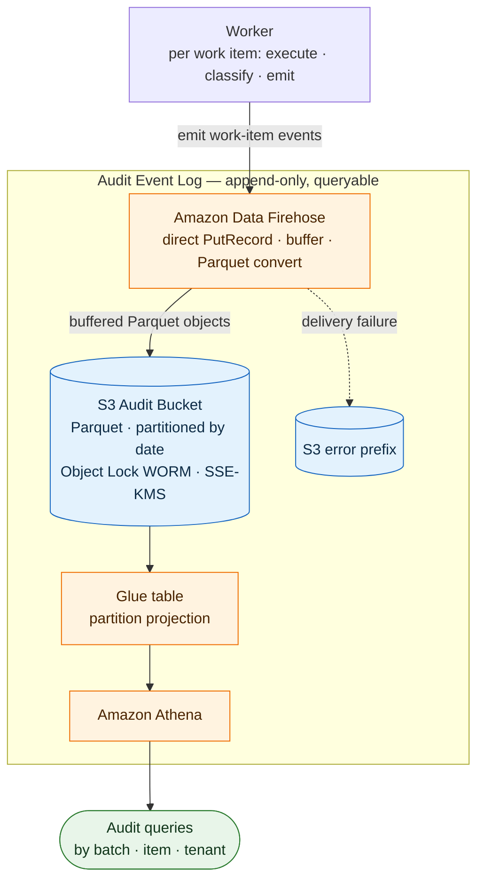

# fanout-audit-log

Append-only audit log for fan-out work-item workflows on AWS.

Workers emit one structured event per work-item occurrence. Events are buffered via AWS Firehose, converted to Parquet, and written to a write-once-read-many (WORM) S3 bucket partitioned by delivery date and queried via Athena.

## Architecture (P0 components)

See [docs/design/technical-design.md](./docs/design/technical-design.md) for technical design.

## Querying audit logs in Athena

The audit logs are queryable via a dedicated Athena workgroup.

**Steps:**

1. Open the [Athena console](https://console.aws.amazon.com/athena/).
2. In the top-right workgroup dropdown, select **`<appQualifier>-auditlog`** (e.g. `fanout-dev-auditlog`). If prompted to acknowledge the workgroup settings, confirm.
3. In the left panel, set the data source to **AwsDataCatalog** and the database to **`<appQualifier>-auditlog`** (e.g. `fanout-dev-auditlog`).
4. In the **Saved queries** tab, open one of the pre-deployed named queries and replace the placeholder value before running:

| Saved query name | Filters on | Placeholder to replace |
|---|---|---|
| `audit-events-by-batch-id` | `batch_id` | `YOUR_BATCH_ID` |
| `audit-events-by-item-id` | `item_id` | `YOUR_ITEM_ID` |
| `audit-events-by-tenant-id` | `tenant_id` | `YOUR_TENANT_ID` |
| `failed-ingestion-audit-events` | `status = 'FAILED'` | — |
| `skipped-ingestion-audit-events` | `status = 'SKIPPED'` | — |

All queries cover the last 7 days, deduplicate on `event_id`, and prune on `dt` with a 1-day lookback buffer to account for Firehose delivery lag.

> `dt` is the Firehose *delivery* date, not `event_time`. Events near a day boundary may land in the following day's partition. The saved queries already account for this — widen the interval manually if querying a longer range.

Query results are written to the `<accountId>-<stage>-audit-log-query-output` S3 bucket and expire after 14 days.
