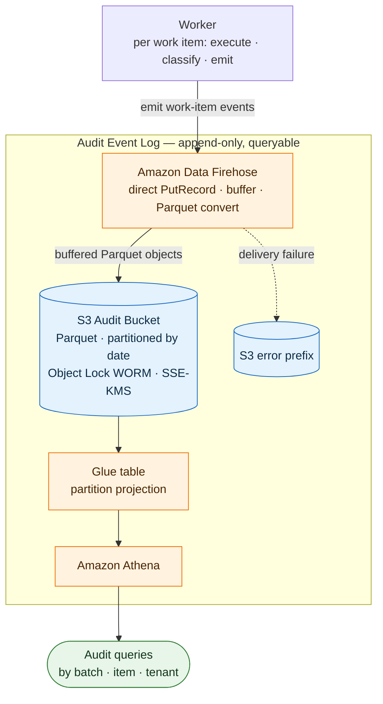

# fanout-audit-log

Append-only audit log for fan-out work-item workflows on AWS.

Workers emit one structured event per work-item occurrence. Events are buffered via AWS Firehose, converted to Parquet, and written to a write-once-read-many (WORM) S3 bucket partitioned by delivery date and queried via Athena.

## Architecture (P0 components)



See [docs/design/technical-design.md](./docs/design/technical-design.md) for technical design.

## Development

```sh
cd cdk
# Install dependencies and run unit tests
npm install && npm test
# Synthesize CDK stacks
npx cdk synth
# Deploy CDK stacks (set up AWS credentials first)
npx cdk deploy --all
```
