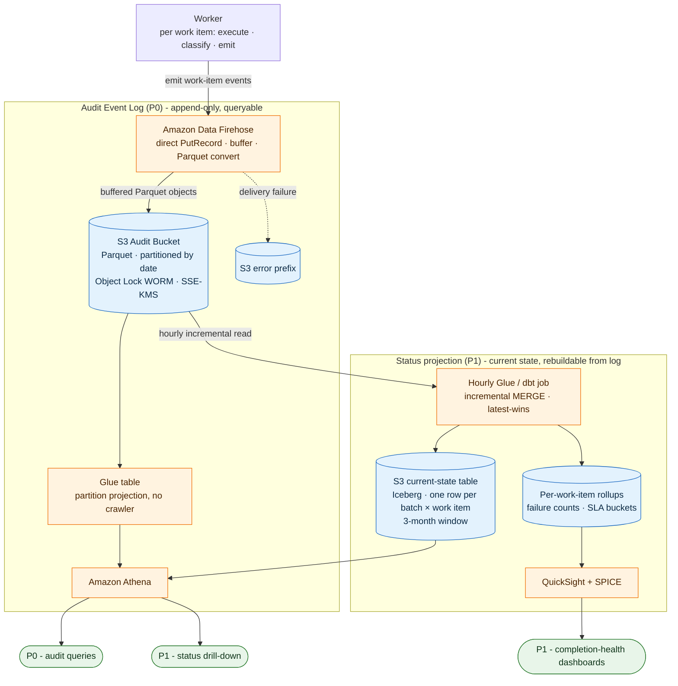

# Fan-Out Work-Item Lifecycle Tracking & Append-Only Audit Log
### Technical design for (1) queryable audit history [P0] and (2) current-status store [P1]

Scope: the audit event log and current-status stores written by the worker(s) executing fanned-out work items.

Out of scope (separate design): redriveable work queues / the fan-out (dispatch) layer.

A *batch* = a parent unit of work that fans out into many independently-tracked **work items**. A *work item* = the smallest independently-tracked action belonging to a batch. The tracker is agnostic to what a work item actually does (e.g. delete, export, reindex, notify) — it tracks lifecycle and completion only.

> **Decision.** P0 audit log → **Firehose → S3 (Parquet, Object Lock, SSE-KMS)**, queried by **Athena**.
>
> P1 status store → an **hourly Glue/dbt job** folding the log into an **S3 Iceberg current-state table (latest-event-wins) + per-work-item rollups**, served by **QuickSight/SPICE** (dashboards) and **Athena** (drill-down).
> The status store is a rebuildable projection of the log (hence P1). DynamoDB and Aurora were considered and are reserved for a future sub-hour, millisecond-latency live-read need — see **Appendix A**.

---

## 1. Requirements

- **Audit log [P0]** — append-only record of events for every work item. Serves as the system of record for work-item completion: consumers can query past events to verify or audit the outcome of a work item, batch, or tenant. Served by **S3 + Athena**.
- **Status store [P1]** — current status of each work item (one per batch × work item): `received → succeeded | failed | skipped`. Powers the completion-health dashboards and audit views (work items ranked by failure count, batches/items approaching or past SLA). Built and served per the decision banner above; the audit log is the source of truth, so this projection is a rebuildable convenience layer (see §4).
- **Cost & ops are primary.** Must scale efficiently across the full range below with no architectural change.

### Scale & derived volume

| | Low | High |
|---|---|---|
| Batches / month | 10 | 10,000 |
| Work items / batch | 10 | 10,000 |

Audit events/month ≈ `batches/mo × avg work items/batch × 2 events/work-item`.

---

## 2. Architecture



**Source of truth is the audit log (P0).** The worker has a **single output**: it emits one explicit, structured event per occurrence to Firehose (durable, append-only). The P1 status projection is **derived downstream** by an hourly Glue/dbt job (see §4) — so no bespoke DLQ/redrive subsystem is needed: there is no second write path on the worker to keep consistent. Firehose is at-least-once and writes undeliverable records to an S3 error prefix; the worker retries `PutRecord` and treats a persistent audit-emit failure as a failure of the unit of work. The error prefix is monitored and alarmed, and records remain durable there until replayed or explicitly discarded (they are not auto-replayed).

---

## 3. Audit Event Log — P0 (S3 + Firehose + Athena)

The append-only, queryable history of record.

- **Ingest**: worker → **Amazon Data Firehose** (direct put). Firehose buffers, converts to **Parquet**, and writes partitioned objects. Buffering means few large files — avoids the small-file / per-object-PUT cost explosion a per-event Lambda writer would cause.
- **Storage**: **S3**, Parquet, partitioned `dt=YYYY/MM/DD`. **S3 Object Lock** for WORM immutability; **SSE-KMS (customer-managed key) + S3 Bucket Keys** (Bucket Keys collapse per-object KMS calls to near-zero, the key cost lever at high volume).
- **Query (P0)**: **Athena** over the Parquet via a Glue table with **partition projection** (no crawler, no `MSCK REPAIR`). Columnar + date-partition pruning means audit queries scan MB, costing fractions of a cent. Sufficient for verification/audit by `batch_id`, `item_id`, or `tenant_id`.
- **Query (P1 projection)**: the current-state table and per-work-item rollups are derived from this log by an hourly job — see §4 for the projection design and §5 for cost.
- **De-duplication**: delivery is at-least-once, so the raw log may contain duplicate rows. `event_id` is the idempotency key — any consumer that counts off the raw log must `COUNT(DISTINCT event_id)` / dedupe accordingly.
- **Durability / Disaster Recovery**: the audit log is the only stateful component that must survive a region loss, so replicate the bucket cross-region with S3 Replication (replica bucket carrying its own Object Lock). The P1 projection is disposable — it is rebuilt from the log by replaying it in the recovery region — so it needs no backup of its own. RPO is bounded by replication lag; RTO for P1 is the rebuild (CTAS) time.

### Audit event record (Parquet schema)

```
event_id      // unique work-item event ID
event_time    // event timestamp
enqueued_at   // timestamp the parent batch was dispatched / fanned out

tenant_id     // owning tenant / grouping dimension
batch_id      // parent batch ID
work_type     // type of work the batch performs

item_id       // work item ID
item_type     // work item type

status        // PENDING | SUCCEEDED | FAILED | SKIPPED

// Any domain-specific metric columns

skip_reason   // reason the work item was skipped
error_code    // failure error code
error_reason  // reason for failure
```

### Firehose delivery & file layout

Firehose buffers incoming events in memory and flushes a single Parquet object — containing **many event rows** — when either the buffer **size** or the buffer **interval** is reached, whichever comes first. With Parquet conversion, buffer size is configurable **64 MB–128 MB** (default 128 MB) and the interval **0–900 s** (default 300 s). At high volume buffers fill on size (fewer, larger files); at low volume they flush on the interval (small files, written only when data is present — no empty objects). Each flush lands one `…/dt=YYYY/MM/DD/<stream>-<timestamp>-<uuid>.parquet` object that Athena reads as part of the table.

---

## 4. Status Projection — P1 (S3 current-state table)

Holds **current state only** — one row per batch × work item — derived from the audit log by an hourly job. Classified **P1**: P0 audit is fully served by the audit log, so this projection is a convenience/perf layer that is rebuildable by replaying the log and can be deferred or recovered without data loss.

- **Build**: an **hourly Glue/dbt job** reads the audit-log partitions written since the last run and **MERGEs** them into the current-state table, keyed by (`batch_id`, `item_id`), keeping the row with the **latest `event_time`** (latest-wins). The same run refreshes per-work-item rollups. Incremental MERGE scans only new partitions, so transform cost stays flat as history grows.
  - Because the MERGE keys on (`batch_id`, `item_id`) and keeps the latest event, it is naturally idempotent — duplicate deliveries collapse to the same row, so the current-state table and any rollup derived from it need no separate dedupe; only direct raw-log counts do.
- **Storage**: an **Iceberg table on S3** (Parquet), one row per batch × work item, partitioned for pruning (e.g. by `tenant_id` / `item_id` bucket). Iceberg gives row-level MERGE/UPDATE and snapshot expiry without rewriting the whole table.
- **Schema (per row)**: audit event record attributes + inferred `time_since_enqueue`.
- **Access patterns** — all flexible SQL, no pre-modeled indexes:
  - "all work items in a batch" → filter `batch_id`.
  - "all batches for a work item" (failure-rate drill-down) → filter `item_id`.
  - "everything currently failed" → `WHERE status = 'failed'`.
  - "work items ranked by open-failure count" → `GROUP BY item_id … ORDER BY count DESC`.
  - "approaching or past SLA" → `WHERE status <> 'succeeded' AND now() - enqueued_at > SLA` (SLA configured per deployment).
- **Serving**: **QuickSight + SPICE** for the dashboards (reads the small rollups; SPICE caches them for fast, hours-fresh loads); **Athena** for ad-hoc drill-down over the current-state table. New dashboard views are new SQL/BI changes, not schema migrations.
- **Freshness**: eventually consistent, **hourly** (bounded by the job cadence). This serves the completion-health UI well; it does **not** serve a latency-sensitive sub-second live "is it done right now" read — for that, see Appendix A Option A (DynamoDB), which composes alongside this projection.
- **Retention**: a rolling **3-month window** (see §6) via Iceberg snapshot/partition expiry (or an S3 lifecycle rule on the table prefix); older state remains in the S3 audit log.
- **Rebuild**: the full table is a CTAS replay of the audit log — no backup/restore subsystem of its own is required.
- **Monitoring**: alarm on hourly job success/duration and on a freshness SLA (e.g. last successful MERGE > 90 min ago). Every dashboard surfaces a "data as of `<last-successful-run>`" watermark, so a stalled job shows visibly stale state rather than a silently-wrong "all green."

---

## 5. Cost Model

Directional; excludes work-item execution compute (out of scope). Monthly costs, us-east-1, 3 sig figs. **P0** = audit log (history). **P1** = S3 current-state projection. Totals combine both. (The DynamoDB serving alternative is costed in Appendix A.)

**Event volume** — assume 2 audit events per (batch × work item): `received` + `success/skip/fail`.

| Scale | Events/month |
|---|---|
| 10 batches/mo × 50 items | 1,000 |
| 100 batches/mo × 100 items | 20,000 |
| 10k batches/mo × 10k items | 200M |
| 10k batches/**day** × 10k items | 6,083M  (`10k × 365/12 × 10k × 2`) |

**Event size:** 1 KB JSON → 250 B Parquet (0.25× compression).

**Rates used (so figures reproduce):**
- Firehose: $0.029/GB ingest + $0.018/GB Parquet conversion, billed on **5 KB-rounded** records ≈ **$0.047/GB** effective.
- S3 Standard: $0.023/GB-mo + $0.005 per 1k PUTs.
- DynamoDB Standard (on-demand): $0.25/GB-mo storage, $0.65 per 1M writes, PITR $0.20/GB-mo. *(Appendix A only.)*
- Athena: $5/TB scanned. KMS: $1/key-mo.

## P0 — Audit log

### Firehose (ingest + Parquet)
Billable GB = events × 5 KB (rounding) ÷ 1,048,576 × $0.047.
- 200M → 954 GB → **$45**; 6,083M → 29,000 GB → **$1,360**.

### S3 storage + PUTs
Storage GB = events/mo × 36 mo × 250 B (3-yr retention, Parquet).
- 200M → 1,676 GB → ~$38.5; 6,083M → 51,000 GB → ~$1,173.

PUTs: Firehose flushes per 5-min buffer (max 64 MB/file):
- 20k/mo → ~2 events/batch-flush → 10k PUTs/mo (~2 KB files)
- 200M/mo → ~22,831 events/flush (22.3 MB JSON → 5.57 MB Parquet) → 8,760 PUTs/mo
- 6,083M/mo → 694,406 events/flush → 165.6 MB > 64 MB ⇒ 3 files/5-min → 26,280 PUTs/mo

PUT cost is negligible at $0.005/1k; totals → **$40.10** (200M), **$1,180** (6,083M).

### Athena (P0 audit)
10 queries/day, each scanning ~1 month of in-scope data; GB/query = (3-yr S3 GB) ÷ 36.
- 200M → 46.6 GB/query → 13.8 TB/mo → **$69**
- 6,083M → 1,417 GB/query → 421 TB/mo → **$2,100**

### KMS — S3 bucket key
1 customer-managed key; Bucket Keys keep API calls near-zero → **~$1/mo**.

## P1 — Status projection (S3 current-state table)

The hourly Glue/dbt job folds the log into an Iceberg current-state table (one row per batch × work item, ½ the event count) plus per-work-item rollups. Three lines: **storage** of the current-state rows, **transform** (incremental MERGE), and **reads** (SPICE-cached dashboards + Athena drill-down). Records over the 3-month window = events/mo × ½ × 3; current-state Parquet row ≈ 250 B (parity with audit-event compression).

| Cost line | 200M events/mo | 6,083M events/mo | Basis |
|---|---|---|---|
| Storage (Iceberg/Parquet, $0.023/GB) | 70 GB → **$1.61** | 2,124 GB → **$48.9** | rows × 250 B (300M / 9,125M rows) |
| Transform (Athena Iceberg MERGE, $5/TB) | 0.14 TB → **$0.68** | 4.15 TB → **$20.8** | ≈3× monthly event scan: read new events once + bounded re-read of affected partitions + write |
| Reads (SPICE-cached dashboards + Athena drill-down) | **~$1** | **~$10** | rollups are MB-scale in SPICE; drill-down hits the small current-state table, partition-pruned |
| KMS — S3 key | shared | shared | reuses the audit-bucket CMK (already counted in P0) |
| **Total (3-mo)** | **~$5/mo** | **~$80/mo** | |

The transform is costed as an Athena/dbt Iceberg MERGE. If run as a Glue Spark job instead, the same work is DPU-hour-priced (few dollars/month at 200M, few hundred dollars/month at 6,083M) — Athena/dbt is cheaper at this scan volume, so it sets the line above. QuickSight per-user (author/reader) licensing is separate and not volume-driven. **Recommend a 3-month window** for the current-state table — older state is already in the S3 audit log, so it need not be kept hot.

> Because the projection reuses the audit-log pipeline (audit-log bucket source, same CMK, same query engine), its marginal cost is storage + transform only. The DynamoDB serving alternative — far more expensive at high volume, driven by `events × 3` writes — is costed in **Appendix A**.

### Summary

Subtotals across scale; per-line breakdown is in the P0 and P1 subsections above.

| Component | 10/mo, 50 items | 100/mo, 100 items | 10k/mo, 10k items | 10k/**day**, 10k items |
|---|---|---|---|---|
| **P0 — Audit log** (Firehose + S3 + Athena + KMS) | ~$1/mo | ~$1/mo | **~$155/mo** | **~$4,640/mo** |
| **P1 — Status projection** (storage + transform + reads) | ~$0/mo | ~$0/mo | **~$5/mo** | **~$80/mo** |
| **Total (P0 + P1)** | **~$1/mo** | **~$1/mo** | **~$160/mo** | **~$4,720/mo** |

P0 (audit log) dominates; P1 is a thin projection of the same pipeline.

---

## 6. Retention

Retention is **configurable per deployment**: default **3 years** for the S3 audit log (P0, enforced with S3 lifecycle rules), default **3 months** for the P1 current-state table (enforced with Iceberg snapshot/partition expiry or an S3 lifecycle rule on the table prefix).

- Set **S3 Object Lock duration = configured retention**, and lifecycle expiration **≥** lock duration, so WORM never blocks the lifecycle delete.
- Cross-region replicas inherit the same Object Lock retention, so the configured duration governs both copies.
- Confirm final retention durations against each deployment's requirements.

---

## 7. Key Decisions & Alternatives

| Decision | Chosen | Rejected alternative | Why |
|---|---|---|---|
| Audit ingest | Firehose direct-put (managed Parquet/buffer) | Hand-rolled `parquet-avro` Lambda writing per-batch files | Managed buffering avoids small-file/PUT-cost problem at high volume; far less code |
| Event source | Worker emits **explicit** semantic events | CDC from a status-table change stream | This taxonomy carries data not stored as status (e.g. domain-specific metrics, skip reasons); explicit events are richer & directly queryable. CDC remains a viable lower-write-coupling fallback |
| Streaming bus | None (worker → Firehose) | Kinesis Data Streams → Firehose | The dispatch layer already fans out and the worker is sole writer; a bus adds cost/ops for no gain here |
| P0 query | Athena directly on S3 | Sync to a separate query DB up front | Partition-pruned Parquet scans are cheap/sufficient for audit; avoids a second datastore |
| P1 dashboards | Per-work-item rollups → QuickSight/SPICE | Athena re-scan on every dashboard load | Pre-aggregation keeps the UI fast and cost flat as history grows |
| Status store priority | **P1**, rebuildable from log | Treating the status projection as P0 | P0 audit is fully served by the audit log; the projection is a convenience/perf layer, so it can be deferred and is recoverable by replay |
| Status serving store | **S3 current-state (Iceberg) + QuickSight/SPICE + Athena**, built hourly | DynamoDB (live ms point reads); Aurora (live + interactive SQL) | All P1 views tolerate hourly staleness, so the projection reuses the audit-log pipeline, serves by-item/failed/failure-rate/SLA views as flexible SQL, and collapses the dominant cost line (~$17k → ~$80/mo at 10k/day). DynamoDB/Aurora are justified only by a sub-hour ms-latency live-read need — see **Appendix A** |
| Status transform | Hourly incremental Iceberg MERGE (latest-wins) | Full daily rebuild; per-event upsert from the worker | Incremental MERGE scans only new partitions (flat cost); keeping it off the worker leaves a single worker write path and a fully rebuildable projection |
| Retention | Configurable, lifecycle + snapshot expiry, 3-yr (S3 log) / 3-mo (current-state) defaults, GOVERNANCE lock | Hardcoded long COMPLIANCE-mode lock | Configurability + the ability to purge stored records when required; avoids an un-deletable-by-anyone trap |
| Encryption | SSE-KMS CMK + S3 Bucket Keys | SSE-S3, or CMK without Bucket Keys | Key-policy control + CloudTrail on decrypts, without per-object KMS cost at scale |

---

## 8. Summary

The worker has a single output — one structured event per work-item occurrence to **Firehose → S3 (Parquet, Object Lock, SSE-KMS)**, the append-only, Athena-queryable audit log that is the source of truth for both stores. The P1 status store is **derived from that log** by an hourly Glue/dbt job into an **Iceberg current-state table (latest-wins) + per-work-item rollups**, served by **QuickSight/SPICE** and **Athena** (P1: rebuildable from the log — §4).

Cost scales: **P0** runs ~$1/mo at low scale to ~$4.6k/mo at 10k batches/day; **P1**, a thin derivation of the same pipeline, adds $5–80/mo — combined **$160/mo (10k batches/mo)** to **$4.7k/mo (10k batches/day)**, with the audit log, not the status store, dominant. DynamoDB and Aurora serving alternatives are reserved for a sub-hour, ms-latency live-read need and costed in **Appendix A**.

---

## Appendix A — P1 latest-status serving: options & recommendation

The P1 status store serves the **latest status of every work item (batch × work item) from the last 3 months**. The body (§4) selects **Option B (the S3 current-state table)**; this appendix records the alternatives considered, costs all three at the §5 scale points at 3-month retention in the §5 style, and sets out the basis for the choice.

The three options differ only in *where the current-state projection lives and how it is read* — the source-of-truth audit log (§3) is unchanged in all three, and so is the rebuildable-projection (P1) classification.

**Shared assumptions.** §5 assumptions (2 events/work-item; ½ as many rows as events; 3-month retention; us-east-1; §5 rates), plus: current-state Parquet row ≈ 250 B; Aurora Serverless v2 I/O-Optimized at **$0.156/ACU-hr** compute and **$0.225/GB-mo** storage (no per-I/O charge). Rows over 3 months = events/mo × ½ × 3:

| Scale | Rows |
|---|---|
| 200M events/mo | 300M |
| 6,083M events/mo | 9,125M |

### Option A — DynamoDB status table (alternative; live ms reads)

One item per work item + 2 GSIs; the worker upserts on every event. Costed here for comparison.

| | Storage (base+GSI, $0.25/GB) | Writes (events × 3 × $0.65/M) | PITR (base, $0.20/GB) | Total (3-mo) |
|---|---|---|---|---|
| 200M | 443.4 GB → $111 | $390 | $57.2 | **~$558** |
| 6,083M | 13,485 GB → $3,370 | $11,900 | $1,740 | **~$17,010** |

**Strengths:** millisecond point reads; real-time freshness; ~$0 at the low end (on-demand). **Weaknesses:** `events × 3` writes dominate and make this the largest line in the whole design; access patterns are fixed at design time (PK + 2 GSIs) — each new view that can't be served by an existing key needs a new GSI (extra write multiple + storage) or a backfill.

### Option B — S3 current-state table (chosen; see §4)

An **hourly Glue/dbt job** MERGEs the audit log into a Parquet/**Iceberg** current-state table (one row per batch × work item, latest-wins) plus per-work-item rollups; **QuickSight/SPICE** serves the dashboards and **Athena** serves drill-down. It reuses the §3 audit-log pipeline — **no new datastore is introduced.** Cost is the §5 P1 line: **~$5/mo (200M events)** to **~$80/mo (6,083M)** — storage + transform only.

**Strengths:** cheapest by 1–2 orders of magnitude; flexible SQL — the by-item / failed / SLA-breach / failure-count-ranked views become ordinary `GROUP BY` / range queries rather than pre-modeled indexes; reuses the existing pipeline; ~$0 at the low end; the status store stays a rebuildable projection of the log (its P1 rationale), only materialised in S3 instead of DynamoDB. **Weaknesses:** eventually consistent (hourly, bounded by refresh cadence); a single-row lookup scans a Parquet partition (seconds), so it does **not** serve a latency-sensitive live "is it done right now" read.

### Option C — Aurora PostgreSQL (Serverless v2) current-state table

A stream/log consumer upserts current state into one Postgres table with secondary indexes; the UI reads it with flexible SQL at millisecond latency. ACU estimates are directional, load test needed for accuracy.

| Cost line | 200M events/mo | 6,083M events/mo | Basis |
|---|---|---|---|
| Compute (ACU, $0.156/ACU-hr) | ~4 ACU → $456 | ~48 ACU → $5,470 | sized to ~77 vs ~2,350 upserts/s avg (incl. index maintenance); high-end carries real sizing risk under peak |
| Storage (I/O-Optimized, $0.225/GB) | 429 GB → $96.5 | 13,050 GB → $2,940 | rows × ~1.5 KB (row + indexes) |
| KMS | $1 | $1 | table CMK |
| **Total (3-mo)** | **~$555/mo** | **~$8,400/mo** | I/O-Optimized chosen to neutralise per-I/O write charges |

**Strengths:** millisecond reads **and** fully flexible interactive SQL (ad-hoc joins/filters); real-time freshness. **Weaknesses:** ACU sizing is the dominant cost and the main estimate risk at high write rates; more operational surface than the two serverless options.

### Comparison

| | 200M ev/mo | 6,083M ev/mo | Low-scale floor | Freshness | Point-read latency | Query flexibility | New datastore? |
|---|---|---|---|---|---|---|---|
| **A. DynamoDB** (alt) | ~$558 | ~$17,010 | ~$0 | real-time | ms (excellent) | rigid (PK + 2 GSIs) | yes |
| **B. S3 current-state** (chosen) | ~$5 | ~$80 | ~$0 | hourly | seconds (poor) | flexible SQL | no (reuses audit pipeline) |
| **C. Aurora SLSv2** (alt) | ~$555 | ~$8,400 | ~$45–90 | real-time | ms (excellent) | flexible SQL | yes |

### Recommendation

**Option B is chosen.** All P1 views tolerate hourly staleness, so the projection reuses the §3 audit-log pipeline, keeps the worker to a single write path, serves the by-item / failed / failure-count-ranked / SLA-breach views as flexible SQL instead of pre-modeled GSIs, and keeps the P1 line orders of magnitude below the DynamoDB alternative ($80 vs $17k/mo at 10k/day). It remains a rebuildable projection of the log, preserving the P1 classification.

Trigger for revisiting this decision: post-MVP, consumers requiring a sub-hour, millisecond-latency read of an individual work item's status.

- **If that need appears → add Option A (DynamoDB)** for that one keyed point-lookup path (provisioned + reserved capacity), fed from the same stream/log, while Option B continues to serve all cross-entity and dashboard views. The two compose cleanly: A handles the keyed hot read, B handles everything aggregate and cheap.
- **Reserve Option C (Aurora)** for the narrower case where live reads must *also* be richly interactive — ad-hoc joins/filters Athena can't serve at acceptable latency. Its always-on floor and ACU-sizing risk aren't justified unless ms-latency **and** interactive SQL are both required.

Because all three keep the §3 audit log as source of truth, the serving store can change later by replaying the log — so adopting B now and bolting on A later (if a live-read requirement emerges) carries no migration penalty.
